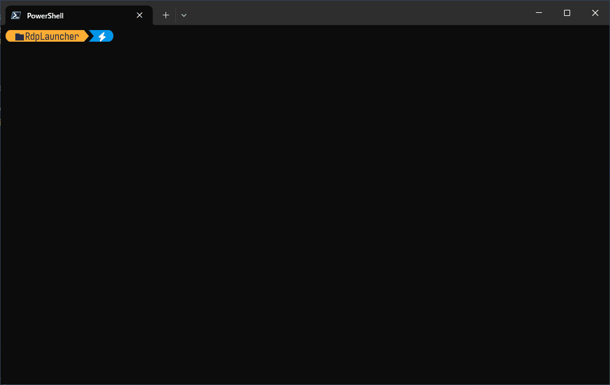

# RdpLauncher

指定されたモニタを利用するようにRDPファイルの編集を簡素化するツールです。

## 概要

RdpLauncherは、リモートデスクトップ接続（RDP）ファイルの作成と管理を簡素化するコンソールアプリケーションです。特に複数モニター環境での接続設定を効率的に行うことができます。

## デモ



## 主な機能

- **インタラクティブなホスト名選択**: 過去に使用したホスト名から選択、または新しいホスト名を入力
- **複数モニター対応**: 使用するモニターIDを指定してマルチモニター接続を設定
- **設定の自動保存**: 入力したホスト名とモニター設定を自動的に保存し、次回以降の入力を簡素化
- **RDPファイル自動生成**: テンプレートから設定に応じたRDPファイルを自動生成
- **ワンクリック起動**: 生成したRDPファイルを即座に起動可能

## 技術仕様

- **フレームワーク**: .NET 10.0
- **UI**: Spectre.Console（インタラクティブなコンソールUI）
- **設定保存**: JSON形式（`rdp-config.json`）
- **テンプレート**: `.template.rdp`ファイルベース

## ファイル構成

```
RdpLauncher/
├── src/RdpLauncher/
│   ├── Program.cs              # メインプログラム
│   ├── RdpLauncher.csproj      # プロジェクトファイル
│   └── templates/
│       └── template.rdp        # RDPテンプレートファイル
├── docs/
│   └── demo.gif                # デモ用GIFファイル
├── .editorconfig               # エディター設定
├── .gitignore                  # Git除外設定
├── global.json                 # .NET SDK設定
├── nuget.config                # NuGet設定
├── RdpLauncher.slnx            # ソリューションファイル
├── LICENSE                     # ライセンスファイル
└── README.md                   # このファイル
```

## 使用方法

### 1. 前提条件

- .NET 10.0 Runtime がインストールされていること
- Windows環境（mstsc.exeが利用可能）

### 2. 実行

```bash
dotnet run --project src/RdpLauncher
```

または、発行済みの実行ファイルを直接実行：

```bash
RdpLauncher.exe
```

### 3. 操作手順

1. **ホスト名の選択/入力**
   - 過去に使用したホスト名がある場合は一覧から選択
   - 新しいホスト名を入力する場合は「新しいホスト名を入力」を選択

2. **モニターIDの指定**
   - 使用するモニターのIDをカンマ区切りで入力（例: `0,1,2`）
   - 過去に使用した設定がある場合は一覧から選択可能

3. **RDPファイル生成**
   - 設定に基づいて `{hostname}-{monitorIds}.rdp` ファイルが自動生成されます

4. **接続開始**
   - 生成されたRDPファイルでリモートデスクトップを起動するか選択

### 4. 設定例

- **単一モニター**: `0`
- **デュアルモニター**: `0,1`
- **トリプルモニター**: `0,1,2`

## 設定ファイル

アプリケーションは以下の設定を `rdp-config.json` に自動保存します：

```json
{
  "Hostnames": [
    "server1.example.com",
    "192.168.1.100"
  ],
  "MonitorConfigs": [
    "0,1",
    "0,1,2"
  ]
}
```

## RDPテンプレート

`templates/template.rdp` ファイルをベースとして、以下の設定が動的に更新されます：

- `selectedmonitors:s:` - 選択されたモニターID
- `use multimon:i:` - マルチモニター使用フラグ（複数モニター時は1、単一時は0）
- `full address:s:` - 接続先ホスト名

## ビルド方法

### 開発環境での実行

```bash
dotnet run --project src/RdpLauncher
```

### リリースビルド

```bash
dotnet build -c Release
```

### 自己完結型実行ファイルの作成

```bash
dotnet publish .\src\RdpLauncher -c Release -r win-x64 -p:PublishSingleFile=true -p:SelfContained=true -p:PublishReadyToRun=false -o artifacts
```

## 依存関係

- [Spectre.Console](https://spectreconsole.net/) v0.54.0 - インタラクティブなコンソールUI

## ライセンス

このプロジェクトのライセンスについては、[LICENSE](LICENSE) ファイルを参照してください。
